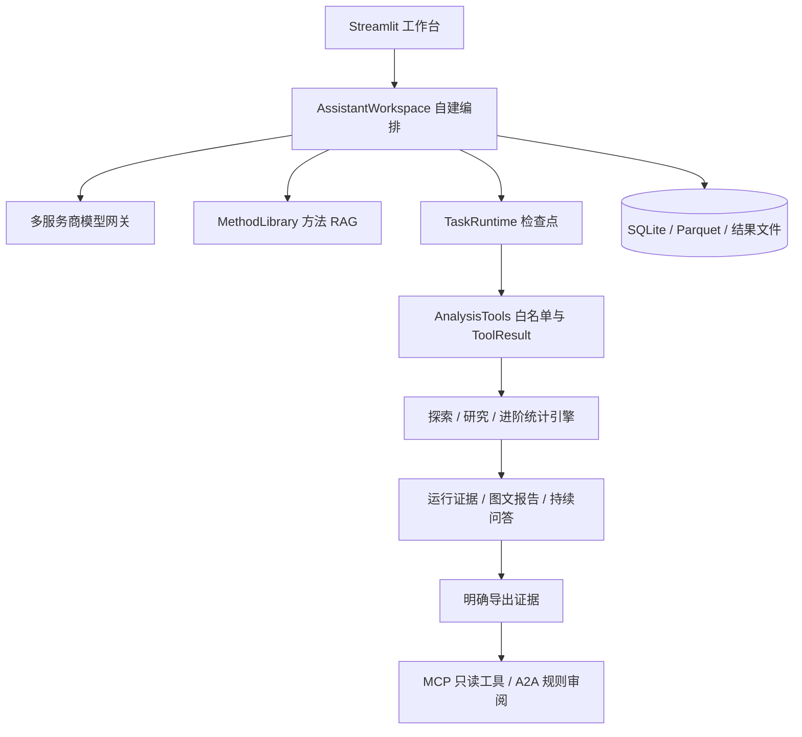
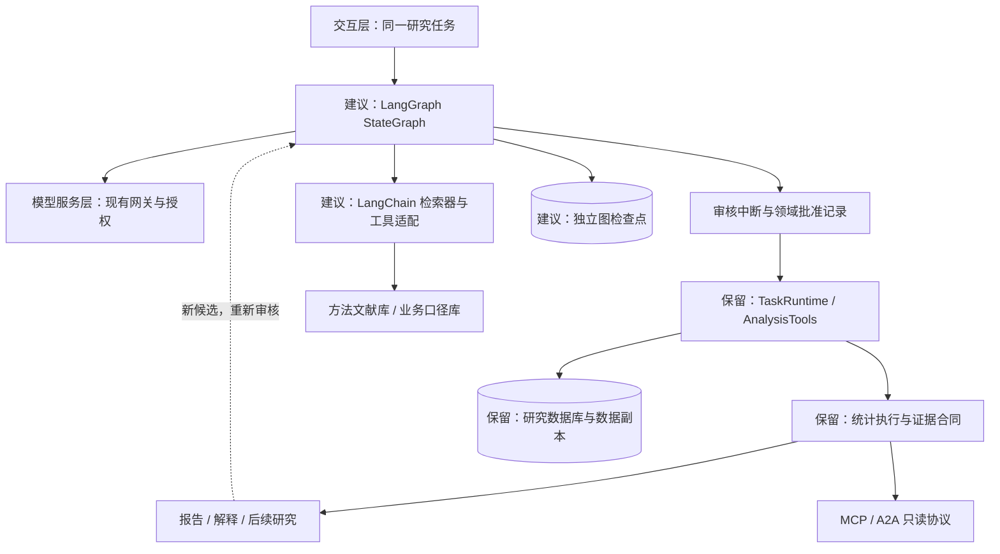
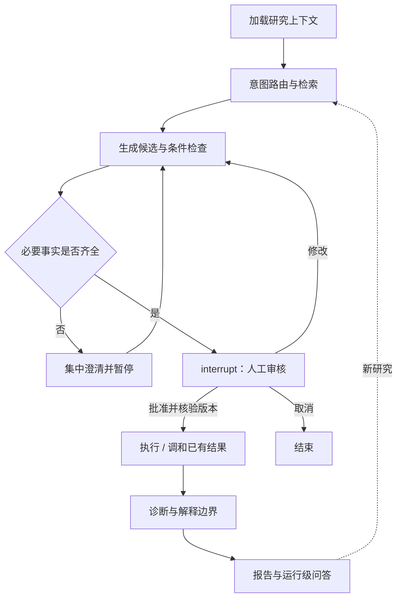
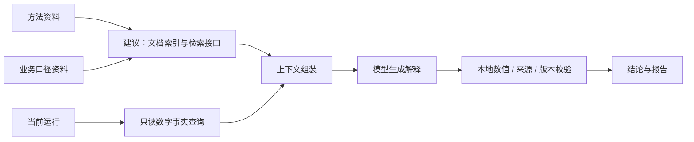

# 图源与状态

SVG用于README和离线阅读。下面的Mermaid图源可在GitHub Markdown中直接渲染。当前图是代码核查结果；带target的图为尚未实施的建议。

## 当前架构

```mermaid
flowchart TB
 U["Streamlit 工作台"] --> A["AssistantWorkspace 自建编排"]
 A --> M["多服务商模型网关"]
 A --> K["MethodLibrary 方法 RAG"]
 A --> R["TaskRuntime 检查点"]
 R --> T["AnalysisTools 白名单与 ToolResult"]
 T --> X["探索 / 研究 / 进阶统计引擎"]
 X --> E["运行证据 / 图文报告 / 持续问答"]
 A --> D[("SQLite / Parquet / 结果文件")]
 E --> P["明确导出证据"]
 P --> C["MCP 只读工具 / A2A 规则审阅"]
```

## 目标架构（建议）

```mermaid
flowchart TB
 U["交互层：同一研究任务"] --> G["建议：LangGraph StateGraph"]
 G --> L["模型服务层：现有网关与授权"]
 G --> K["建议：LangChain 检索器与工具适配"]
 G --> H["审核中断与领域批准记录"]
 H --> T["保留：TaskRuntime / AnalysisTools"]
 T --> E["保留：统计执行与证据合同"]
 E --> Q["报告 / 解释 / 后续研究"]
 G --> CP[("建议：独立图检查点")]
 T --> DB[("保留：研究数据库与数据副本")]
 K --> KR["方法文献库 / 业务口径库"]
 E --> PR["MCP / A2A 只读协议"]
 Q -. "新候选，重新审核" .-> G
```

## 研究工作流（建议）

```mermaid
flowchart TB
 A["加载研究上下文"] --> B["意图路由与检索"]
 B --> C["生成候选与条件检查"]
 C --> D{"必要事实是否齐全"}
 D -->|否| E["集中澄清并暂停"]
 E --> C
 D -->|是| F["interrupt：人工审核"]
 F -->|批准并核验版本| G["执行 / 调和已有结果"]
 F -->|修改| C
 F -->|取消| Z["结束"]
 G --> H["诊断与解释边界"]
 H --> I["报告与运行级问答"]
 I -. "新研究" .-> B
```

## 知识与证据双通道（建议）

```mermaid
flowchart LR
 M["方法资料"] --> I["建议：文档索引与检索接口"]
 B["业务口径资料"] --> I
 I --> C["上下文组装"]
 R["当前运行"] --> F["只读数字事实查询"]
 F --> C
 C --> L["模型生成解释"]
 L --> V["本地数值 / 来源 / 版本校验"]
 V --> O["结论与报告"]
```
